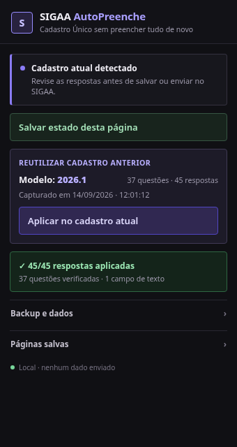

# SIGAA AutoPreenche

Extensão para Chromium que reduz o trabalho repetitivo no **Cadastro Único do SIGAA/UFRN**.

Ela salva respostas localmente, restaura o formulário quando a sessão do SIGAA expira e também consegue **capturar um cadastro de período anterior e reaplicar as respostas no período atual**.

> Projeto independente e não oficial. Não possui vínculo com a UFRN, SIGAA ou STI/SINFO.



## O que ela faz

- Salva o estado do formulário no navegador.
- Restaura respostas depois de logout, expiração de sessão ou recarregamento.
- Captura respostas de um Cadastro Único antigo em modo de visualização.
- Reutiliza essas respostas em um novo período.
- Suporta alternativas únicas, múltiplas marcações e campos de texto.
- Verifica o resultado depois da aplicação e informa divergências.
- Exporta e importa backup em JSON.
- Mantém os dados no próprio navegador; a extensão não possui servidor próprio.

## Instalação

A extensão ainda não é distribuída pela Chrome Web Store. Para instalar localmente:

1. Baixe ou clone este repositório.
2. Abra `chrome://extensions` no Chrome, Chromium, Brave ou outro navegador compatível.
3. Ative **Modo do desenvolvedor**.
4. Clique em **Carregar sem compactação**.
5. Selecione a pasta `src/` deste repositório.
6. Recarregue as abas do SIGAA que já estavam abertas.

## Uso

### Salvar e restaurar uma página

1. Preencha o formulário normalmente.
2. Abra a extensão e clique em **Salvar estado desta página**.
3. Se a sessão expirar, entre novamente no SIGAA e volte para o mesmo formulário.
4. Use a opção de restauração da página salva.

### Reutilizar um Cadastro Único de outro período

1. Abra a visualização de uma adesão/cadastro anterior.
2. Abra a extensão e clique em **Capturar cadastro anterior**.
3. Entre no Cadastro Único editável do período atual.
4. Clique em **Aplicar no cadastro atual**.
5. Confira o relatório mostrado pela extensão.
6. Revise as respostas no SIGAA antes de salvar ou enviar.

A extensão **não envia o formulário automaticamente**.

## Como o reaproveitamento funciona

O SIGAA usa identificadores JSF que podem mudar entre páginas e períodos. Por isso, o AutoPreenche não depende apenas desses IDs.

Para reaproveitar um cadastro anterior, a extensão guarda informações como:

- texto normalizado da pergunta;
- texto da alternativa;
- tipo do campo (`radio`, `checkbox` ou texto);
- posição da alternativa como fallback.

Assim, mudanças nos identificadores internos do SIGAA tendem a não quebrar o preenchimento entre períodos.

## Privacidade

Os dados capturados são armazenados em `chrome.storage.local` no navegador.

A extensão não envia as respostas do Cadastro Único para um servidor próprio e não armazena senhas, arquivos enviados, campos ocultos ou botões.

**Atenção:** o backup JSON pode conter informações pessoais e socioeconômicas. Trate esse arquivo como dado privado e evite publicá-lo ou anexá-lo a issues.

## Permissões

O `manifest.json` limita a extensão ao domínio:

```text
https://sigaa.ufrn.br/*
```

Permissões utilizadas:

- `storage`: salvar respostas e configurações localmente;
- `activeTab`: identificar e interagir com a aba atual do SIGAA.

## Estrutura do projeto

```text
sigaa-autopreenche/
├── src/
│   ├── manifest.json
│   ├── content.js
│   ├── popup.html
│   ├── popup.js
│   ├── icon16.png
│   ├── icon48.png
│   └── icon128.png
├── docs/
│   └── screenshots/
│       └── popup-v1.3.0.png
├── .gitignore
├── CHANGELOG.md
├── LICENSE
└── README.md
```

## Desenvolvimento

Não há etapa de build, `npm install` ou servidor local.

Para testar alterações:

1. Edite os arquivos em `src/`.
2. Abra `chrome://extensions`.
3. Clique em **Recarregar** no card da extensão.
4. Recarregue a página do SIGAA.

Para erros no `content.js`, use o DevTools da página do SIGAA. Para erros do popup, abra o popup e use a opção de inspecioná-lo pelo painel de extensões.

## Versão atual

**v1.3.0**

Nesta versão, a interface foi refeita com foco em legibilidade, feedback pós-aplicação e privacidade. Também foram adicionados relatório de divergências, identificação do período do modelo e uma área secundária para backup.

Veja o histórico em [CHANGELOG.md](CHANGELOG.md).

## Licença

Distribuído sob a licença MIT. Veja [LICENSE](LICENSE).
